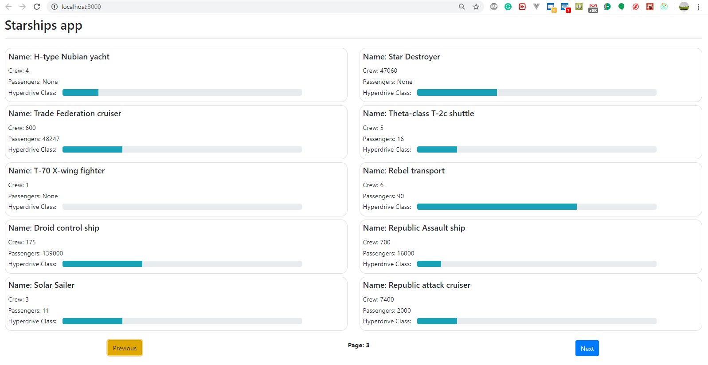

This project was bootstrapped with [Create React App](https://github.com/facebook/create-react-app).

## Available Scripts

In the project directory, First install node_modules
by:
### `yarn install`

Then you can run:

### `yarn start`

Runs the app in the development mode. 
Open [http://localhost:3000](http://localhost:3000) to view it in the browser.

Also I did not find any information about Unit testing so  I did not add jest/enzyme

Additionally I have added Loading spinner

---
Please see the `screenshot` to see the view

